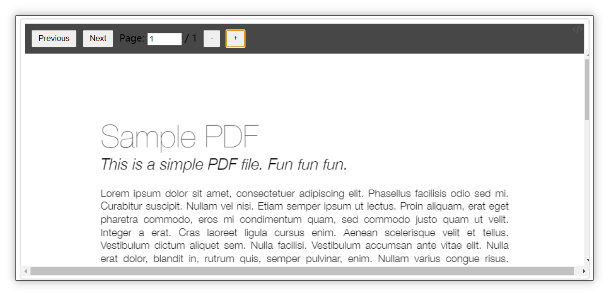
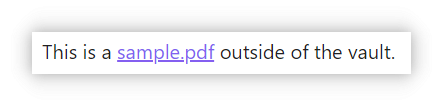
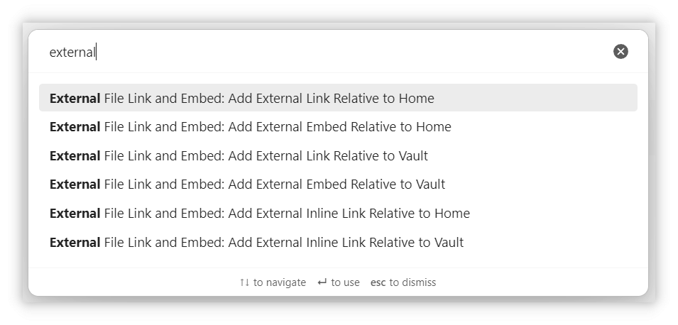

# External File Embed and Link

Embed and link local files outside your obsidian vault with relative paths for cross-device and multi-platform compatibility.

## Features

1. Embed external files (Markdown, PDF, Images, Audio, Video) outside your obsidian vault.
2. Create links to files outside your obsidian vault that open with system default applications.
3. Reference files using virtual directories for cross-device and cross-platform compatibility.
4. Provide commands to add embeds or links via file picker.

## Virtual Directories

The plugin uses a flexible virtual directory system that allows you to:

- Map any local directory to a virtual directory ID
- Configure different paths per device for the same virtual directory ID
- Access files using the format: `VirtualDirectoryId://relative/path/to/file`

Home and vault directories are pre-defined as virtual directories:
- `home://` - Points to your user home directory
- `vault://` - Points to your Obsidian vault directory

You can define additional virtual directories in the plugin settings. This allows you to:

1. Use the same note across multiple devices, even when file paths differ
2. Reference files outside your vault in a consistent way
3. Maintain compatibility across different operating systems

## Detailed Usage

### Embedding External Files

You can embed files using paths relative to a virtual directory. For example, if your Home path is `C:\Users\username`, you can embed a PDF file from `C:\Users\username\SynologyDrive\work\Document.pdf` like this:

~~~markdown
```EmbedRelativeTo
home://SynologyDrive/work/Document.pdf
```
~~~

This will be rendered in Live Preview and Reading Mode as:



You can also use a custom virtual directory. For example, if you've defined a virtual directory called "project" that points to different paths on different computers:

~~~markdown
```EmbedRelativeTo
project://documents/report.pdf
```
~~~

Using virtual directories ensures compatibility across different computers and operating systems, especially useful when syncing files with services like SynologyDrive.

### Supported File Types for Embedding

Almost the same as Obsidian's [Accepted file formats](https://help.obsidian.md/Files+and+folders/Accepted+file+formats) documentation except for JSON Canvas files.

- **Markdown**: `.md`, `.markdown`, `.txt`
- **Images**: `.avif`, `.bmp`, `.gif`, `.jpeg`, `.jpg`, `.png`, `.svg`, `.webp`
- **Audio**: `.flac`, `.m4a`, `.mp3`, `.ogg`, `.wav`, `.webm`, `.3gp`
- **Video**: `.mkv`, `.mov`, `.mp4`, `.ogv`, `.webm`
- **PDF**: `.pdf`

### Embedding Options

Following Obsidian's [Embed files](https://help.obsidian.md/Linking+notes+and+files/Embed+files) documentation, this plugin supports parameters for controlling display behavior:

#### Markdown Files

Add header name after `#` to embed only the header section:

~~~markdown
```EmbedRelativeTo
home://SynologyDrive/work/Document.md#This is a header
```
~~~

#### PDF Files
Add parameters after `#` to control page number, width, and height:

~~~markdown
```EmbedRelativeTo
home://SynologyDrive/work/Document.pdf#page=3&width=100%&height=80vh
```
~~~

#### Images & Videos
Add dimensions after `|` to control size:

~~~markdown
```EmbedRelativeTo
home://Downloads/test.png|400
```
~~~

~~~markdown
```EmbedRelativeTo
home://Videos/test.mp4|800x600
```
~~~

#### Folders

You can embed a folder by put  `/#` after the folder name , and it will list all the files in the folder.
You can also add parameters after `#` to filter the files to embed.

~~~markdown
```EmbedRelativeTo
home://Downloads/#extensions=pdf,mp4
```
~~~

### External File Links

If you don't need to render the file content in Reading Mode, you can create inline links within paragraphs to external files:

~~~markdown
This is a <a href="#home://Downloads/sample.pdf" class="LinkRelativeTo">sample.pdf</a> outside of the vault.
~~~

Which renders as:



### Adding Embeds or Links

#### Using Commands
Type "external" in the command palette to see available options:

- `Add external embed`: Opens a dialog to select a virtual directory and file for embedding
- `Add external inline link`: Opens a dialog to select a virtual directory and file for linking

Both commands will automatically generate the appropriate code with the correct syntax.



## Acknowledgement and License Notice

This project uses [PDF.js](https://github.com/mozilla/pdf.js) for PDF rendering, which is made available under the [Apache License 2.0](https://www.apache.org/licenses/LICENSE-2.0). A copy of the PDF.js license can be found in the `LICENSE` file of the PDF.js repository. 

If you distribute this project or its binaries, please ensure that you include the appropriate copyright and license notices as required by the Apache License 2.0. 

For more information on PDF.js and its contributors, visit the official [GitHub repository](https://github.com/mozilla/pdf.js).
