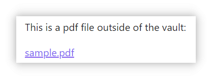
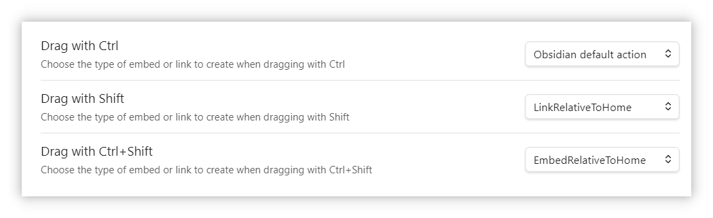

# External File Embed and Link

Embed and link local files outside your obsidian vault with relative paths for cross-device and multi-platform compatibility.

## Features

1. Embed external files (Markdown, PDF, Images, Audio, Video) outside your obsidian vault.
2. Create links to files outside your obsidian vault that open with system default applications.
3. Reference files using paths relative to Home directory or Vault directory for cross-device and cross-platform compatibility.
4. Provide commands to add embeds or links via file picker.
5. Support drag & drop to create embeds or links.

## Detailed Usage

### Embedding External Files

You can embed files using paths relative to your Home directory. For example, if your Home path is `C:\Users\username`, you can embed a PDF file from `C:\Users\username\SynologyDrive\work\Document.pdf` like this:

~~~markdown
```EmbedRelativeToHome
SynologyDrive/work/Document.pdf
```
~~~

This will be rendered in Live Preview and Reading Mode as:


If your Obsidian vault is located at `C:\Users\username\SynologyDrive\obsidian`, you can embed the same file using a path relative to your vault:

~~~markdown
```EmbedRelativeToVault
../work/Document.pdf
```
~~~

Using relative paths ensures compatibility across different computers and operating systems, especially useful when syncing files with services like SynologyDrive.

### Supported File Types for Embedding

Almost the same as Obsidian's [Accepted file formats](https://help.obsidian.md/Files+and+folders/Accepted+file+formats) documentation except for JSON Canvas files.

- **Markdown**: `.md`, `.markdown`, `.txt`
- **Images**: `.avif`, `.bmp`, `.gif`, `.jpeg`, `.jpg`, `.png`, `.svg`, `.webp`
- **Audio**: `.flac`, `.m4a`, `.mp3`, `.ogg`, `.wav`, `.webm`, `.3gp`
- **Video**: `.mkv`, `.mov`, `.mp4`, `.ogv`, `.webm`
- **PDF**: `.pdf`

### Embedding Options

Following Obsidian's [Embed files](https://help.obsidian.md/Linking+notes+and+files/Embed+files) documentation, this plugin supports parameters for controlling display behavior:

#### Markdown Files

Add header name after `#` to embed only the header section:

~~~markdown
```EmbedRelativeToHome
SynologyDrive/work/Document.md#This is a header
```
~~~

#### PDF Files
Add parameters after `#` to control page number, width, and height:

~~~markdown
```EmbedRelativeToHome
SynologyDrive/work/Document.pdf#page=3&width=100%&height=80vh
```
~~~

#### Images & Videos
Add dimensions after `|` to control size:

~~~markdown
```EmbedRelativeToHome
Downloads/test.png|400
```
~~~

~~~markdown
```EmbedRelativeToHome
Videos/test.mp4|800x600
```
~~~

#### Folders

You can embed a folder, and it will list all the files in the folder.
You can also add parameters after `#` to filter the files to embed.


~~~markdown
```EmbedRelativeToHome
Downloads/#extensions=pdf,mp4
```
~~~


### External File Links

If you don't need to render the file content in Reading Mode, you can create links to external files:

~~~markdown
This is a pdf file outside of the vault:
```LinkRelativeToHome
Downloads/sample.pdf
```
~~~

This will be rendered as:



For inline links within paragraphs, use:

~~~markdown
This is a <a class=LinkRelativeToHome>Downloads/sample.pdf</a> outside of the vault.
~~~

Which renders as:


### Adding Embeds or Links

#### Using Commands
Type "external" in the command palette to see available options:


#### Using Drag & Drop
Create embeds or links by holding modifier keys (`ctrl`, `shift`, `ctrl+shift`) while dragging files. 

Modifier keys can be customized in the plugin settings:




## Acknowledgement and License Notice

This project uses [PDF.js](https://github.com/mozilla/pdf.js) for PDF rendering, which is made available under the [Apache License 2.0](https://www.apache.org/licenses/LICENSE-2.0). A copy of the PDF.js license can be found in the `LICENSE` file of the PDF.js repository. 

If you distribute this project or its binaries, please ensure that you include the appropriate copyright and license notices as required by the Apache License 2.0. 

For more information on PDF.js and its contributors, visit the official [GitHub repository](https://github.com/mozilla/pdf.js).
